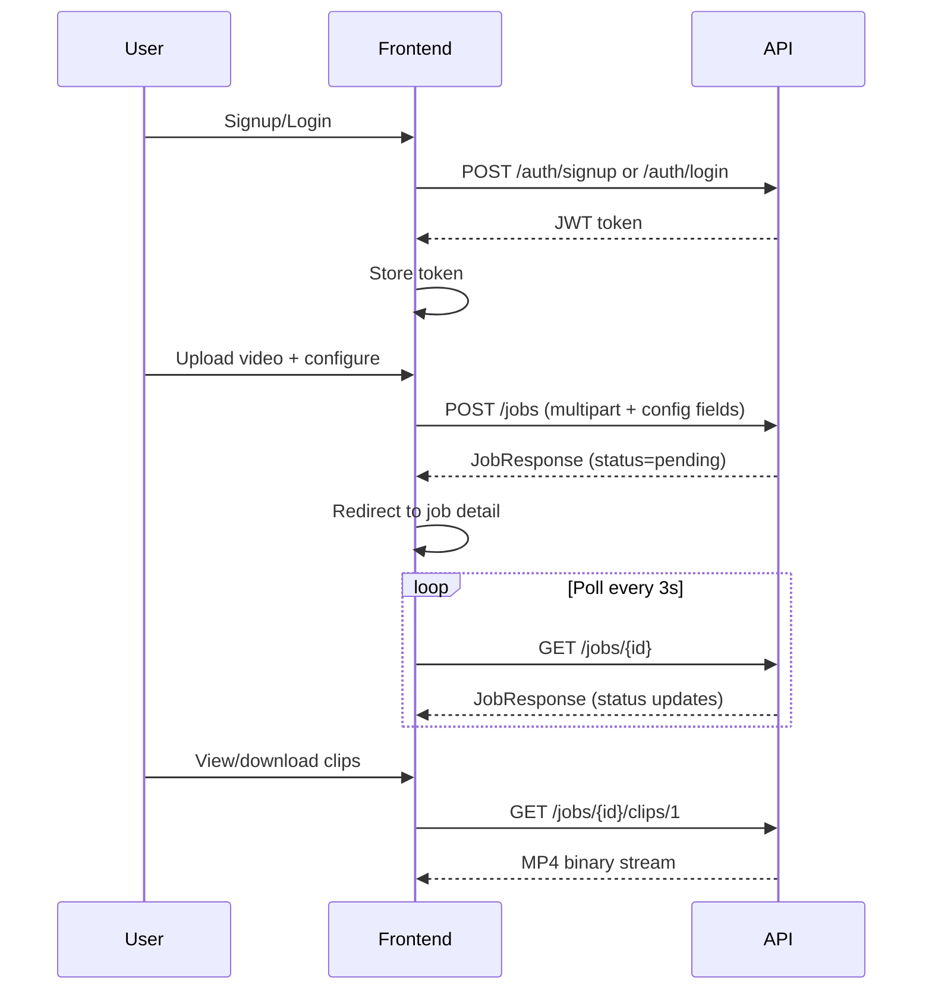

# Frontend Specification -- Clipping Engine

This is a handoff document for the frontend developer. The backend is a FastAPI server at `http://localhost:8000`. Swagger docs live at `/docs`.

---

## API Endpoints (complete list)

All endpoints except `/health`, `/auth/signup`, and `/auth/login` require a JWT Bearer token in the `Authorization` header.

### Auth

| Method | Path | Body | Response | Notes |
|--------|------|------|----------|-------|
| POST | `/auth/signup` | `{ email, password }` | `{ access_token, token_type }` | password min 6 chars |
| POST | `/auth/login` | `{ email, password }` | `{ access_token, token_type }` | |
| GET | `/auth/me` | -- | `{ id, email, created_at }` | requires token |

### Jobs

| Method | Path | Body | Response | Notes |
|--------|------|------|----------|-------|
| POST | `/jobs` | `multipart/form-data` (video file + config fields) | `JobResponse` (status=pending) | 202 Accepted, job starts in background |
| GET | `/jobs` | -- | `{ jobs: JobResponse[] }` | all jobs for current user, newest first |
| GET | `/jobs/{id}` | -- | `JobResponse` | poll this for status updates |
| GET | `/jobs/{id}/clips/{n}` | -- | binary MP4 file | n = 1-based clip number |
| GET | `/health` | -- | `{ status: "ok" }` | no auth needed |

---

## Every Configurable Field (the job submission form)

These are the form fields sent as `multipart/form-data` alongside the video file when calling `POST /jobs`. Every field has a default so only the video upload is truly required.

### Core Pipeline Settings

- **top_k** -- Number of clips to extract
  - Type: integer, range 1-10, default: 2
  - UI: slider or number input

- **clip_duration** -- Target clip length in seconds
  - Type: float, range 15-120, default: 60
  - UI: slider with "15s / 30s / 45s / 60s / 90s / 120s" presets

- **model_size** -- Whisper transcription accuracy
  - Type: enum, one of: `tiny`, `base`, `small`, `medium`, `large`
  - Default: `base`
  - UI: dropdown or radio group. Label it "Transcription Quality". Show tradeoff: tiny=fastest, large=most accurate

- **min_score** -- Minimum virality score to keep a clip
  - Type: integer, range 0-100, default: 40
  - UI: slider with label "Quality Threshold"

- **llm_model** -- AI model override (advanced)
  - Type: string, optional (null = auto)
  - Default: null (uses Gemini 2.5 Flash with Qwen3 fallback)
  - UI: text input, collapsed under "Advanced" section. Placeholder: "Auto (Gemini 2.5 Flash)"

### Post-Processing Toggles

- **enable_hooks** -- Reorder clip so the hook sentence plays first
  - Type: boolean, default: true
  - UI: toggle switch

- **enable_captions** -- Burn animated subtitles into clips
  - Type: boolean, default: true
  - UI: toggle switch

- **enable_enhancements** -- Apply fade, loudness normalization, progress bar
  - Type: boolean, default: true
  - UI: toggle switch

- **vertical** -- Reframe to 9:16 portrait (for Shorts/Reels/TikTok)
  - Type: boolean, default: false
  - UI: toggle switch. Label: "Vertical (9:16)"

### Advanced Enhancement Options (show in collapsible "Advanced" section)

- **fade_in** -- Fade-in duration in seconds
  - Type: float, range 0-2, default: 0.3
  - UI: small slider

- **fade_out** -- Fade-out duration in seconds
  - Type: float, range 0-2, default: 0.5
  - UI: small slider

- **normalize_audio** -- EBU R128 loudness normalization
  - Type: boolean, default: true
  - UI: toggle

- **progress_bar** -- Animated progress bar at bottom of video
  - Type: boolean, default: true
  - UI: toggle

- **caption_font** -- Subtitle font face
  - Type: string, default: "Arial"
  - UI: dropdown with common fonts

- **caption_font_size** -- Subtitle font size
  - Type: integer, range 10-72, default: 22
  - UI: number input or slider

---

## Pages (5 total)

### Page 1: Login / Signup (`/login`)

- Single page with two tabs or a toggle: "Login" and "Sign Up"
- Fields: email, password (+ confirm password on signup)
- On success: store JWT in localStorage/cookie, redirect to Dashboard
- On 409 (signup): "Email already registered"
- On 401 (login): "Invalid email or password"

### Page 2: Dashboard (`/dashboard`)

- Header with user email and logout button
- "New Job" button (prominent, top-right) -- navigates to `/new-job`
- Job list table/cards showing all past jobs, newest first (`GET /jobs`)
- Each job card shows:
  - Video filename
  - Status badge: `pending` (yellow), `processing` (blue/spinner), `completed` (green), `failed` (red)
  - Created date
  - Number of clips (if completed)
  - Click to navigate to `/jobs/{id}`
- Auto-refresh: poll `GET /jobs` every 5-10 seconds while any job is pending/processing

### Page 3: New Job (`/new-job`)

- **Step 1: Upload** -- drag-and-drop or click-to-browse video file input. Show filename and file size after selection.
- **Step 2: Configure** -- the form fields from the section above, organized into:
  - "Core Settings" group (top_k, clip_duration, model_size, min_score) -- always visible
  - "Post-Processing" group (enable_hooks, enable_captions, enable_enhancements, vertical) -- always visible, toggle switches in a row
  - "Advanced" collapsible section (llm_model, fade_in, fade_out, normalize_audio, progress_bar, caption_font, caption_font_size) -- collapsed by default
- **Submit button** -- calls `POST /jobs` with multipart form, shows loading state, on success redirect to `/jobs/{id}`

### Page 4: Job Detail (`/jobs/{id}`)

- Poll `GET /jobs/{id}` every 3 seconds while status is pending/processing
- **Header**: video filename, status badge, timestamps
- **While processing**: show progress text (e.g. "Stage 4/7: Ranking clips..."), a spinner/progress animation
- **If failed**: show error message in a red alert box
- **If completed**: show results section:
  - Summary stats: total segments, total chunks, clips extracted
  - Clip cards -- one per clip, each showing:
    - Embedded video player (`<video>` tag pointing at `GET /jobs/{id}/clips/{n}`)
    - Virality score (big number), hook_strength, standalone_score, curiosity_score as smaller badges
    - Hook text (highlighted)
    - Reason / reason_short
    - Transcript text (collapsible)
    - Download button (triggers `GET /jobs/{id}/clips/{n}` as download)
    - Duration, start time, end time

### Page 5: Settings / Account (`/settings`) -- optional / low priority

- Show current email
- Change password (future)
- Logout button

---

## Data Flow Summary



---

## Job Response Shape (what the frontend receives)

```json
{
  "id": "uuid",
  "status": "pending | processing | completed | failed",
  "progress": "Stage 4/7: Ranking clips...",
  "error": null,
  "config": {
    "top_k": 2,
    "clip_duration": 60.0,
    "model_size": "base",
    "min_score": 40,
    "llm_model": null,
    "enable_hooks": true,
    "enable_captions": true,
    "enable_enhancements": true,
    "vertical": false,
    "fade_in": 0.3,
    "fade_out": 0.5,
    "normalize_audio": true,
    "progress_bar": true,
    "caption_font": "Arial",
    "caption_font_size": 22
  },
  "result": {
    "total_segments": 701,
    "total_chunks": 35,
    "selected_clips": 3,
    "clips": [
      {
        "path": "jobs/uuid/outputs/clip_1.mp4",
        "start": 245.5,
        "end": 305.2,
        "duration": 59.7,
        "virality_score": 92,
        "confidence": 88,
        "hook_strength": 95,
        "standalone_score": 90,
        "curiosity_score": 85,
        "reason": "Bold personal revelation with emotional intensity",
        "reason_short": "bold claim",
        "hook_text": "I was broke at 25 and nobody believed in me.",
        "transcript_text": "I was broke at 25 and nobody believed in me. But that year..."
      }
    ]
  },
  "video_filename": "podcast_episode_42.mp4",
  "created_at": "2026-05-09T20:00:00Z",
  "completed_at": "2026-05-09T20:05:00Z"
}
```

---

## Tech Recommendations for Frontend

- **Framework**: Next.js (React) with Tailwind CSS
- **Auth**: store JWT in httpOnly cookie or localStorage, attach as `Authorization: Bearer <token>` header on every request
- **File upload**: use `FormData` with `fetch()` or axios
- **Polling**: `setInterval` or React Query's `refetchInterval` for job status
- **Video playback**: native `<video>` tag pointing at the clip download URL with the auth token as a query param or via a blob URL
