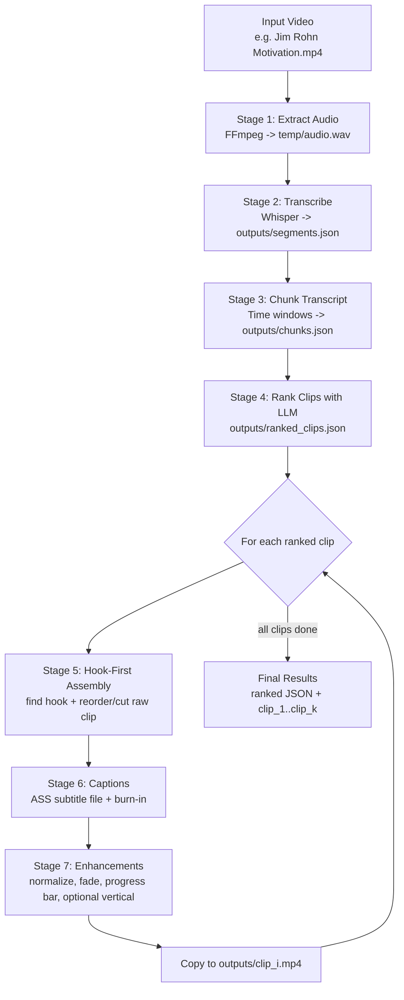
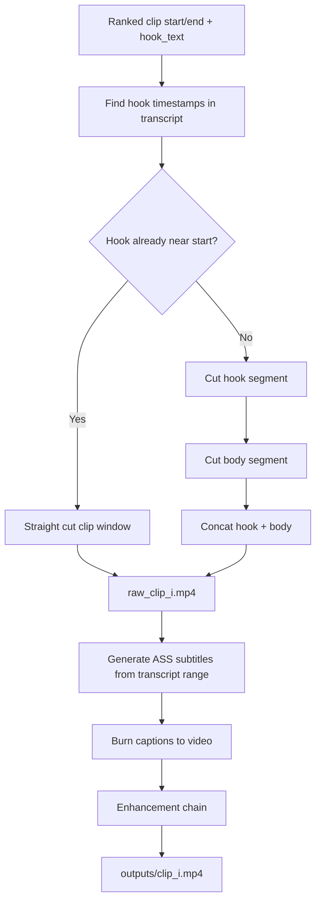
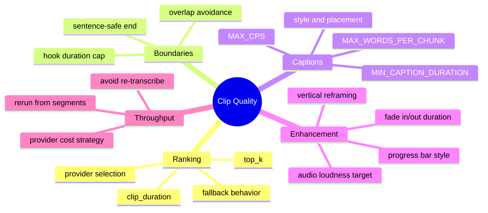

# Clipping Engine Pipeline — Visual Guide

This document explains how the clipping pipeline works end-to-end, what each step does, and where quality/output behavior can be tuned.

---

## 1) End-to-End Flow (Primary Pipeline)



### Purpose of each stage

- **Stage 1 — Audio extraction**: Converts the source video to a clean audio stream Whisper can process.
- **Stage 2 — Transcription**: Builds timestamped speech segments (`start`, `end`, `text`) used by all downstream logic.
- **Stage 3 — Chunking**: Creates larger transcript windows to summarize timeline structure and debugging visibility.
- **Stage 4 — Ranking**: Selects top clip windows by virality/hook quality using LLM reasoning.
- **Stage 5 — Hook-first assembly**: Reorders clip so the strongest sentence lands first when possible.
- **Stage 6 — Captions**: Generates readable subtitle timing and burns captions directly into the video.
- **Stage 7 — Enhancements**: Applies polish for social media playback quality and retention.

---

## 2) LLM Ranking + Fallback Logic

```mermaid
flowchart LR
    A[rank_clips()] --> B{Provider forced?}
    B -->|Yes| C[Use requested provider only]
    B -->|No| D[Try Gemini]
    D -->|fail| E[Try xAI]
    E -->|fail| F[Try Groq]
    D -->|success| G[Raw ranked clips]
    E -->|success| G
    F -->|success| G
    F -->|all fail| H[Raise RuntimeError]

    C --> G
    G --> I[Duration Guard<br/>expand too-short clips]
    I --> J[Return final ranked clips]
```

### Why this matters

- Keeps pipeline resilient when one provider is rate-limited or unavailable.
- Prevents hook-only micro-clips by applying post-ranking duration enforcement.

---

## 3) Clip Assembly Internals (Per Clip)



---

## 4) Fast Re-Run Path (No Re-Transcription)

```mermaid
flowchart LR
    A[outputs/segments.json exists] --> B[scripts/generate_clips_from_segments.py]
    B --> C[Rank again (top-k / provider / clip-duration)]
    C --> D[Hook + Captions + Enhancement only]
    D --> E[New outputs/clip_i.mp4]
```

Use this when testing ranking behavior, clip quality, caption pacing, or hook logic without paying the full transcription cost each run.

---

## 5) Core Files and Responsibilities

- `engine/pipeline.py`  
  Main orchestrator for full 7-stage run.

- `engine/core/ffmpeg.py`  
  FFmpeg command wrapper and audio extraction helper.

- `engine/core/transcribe.py`  
  Whisper transcription to timestamped segments.

- `engine/core/chunker.py`  
  Segment grouping into chunk windows.

- `engine/core/ranker.py`  
  LLM prompt + provider fallback + clip-duration post-processing.

- `engine/core/hooks.py`  
  Hook timestamp match and hook-first video assembly.

- `engine/core/captions.py`  
  ASS subtitle generation (phrase split, CPS pacing, min duration) + burn-in.

- `engine/core/enhance.py`  
  Normalize audio, fades, progress bar, optional vertical reframing.

- `scripts/generate_clips_from_segments.py`  
  Fast iterative test route from existing transcript.

---

## 6) Quality Tuning Map (What You Can Play With)



---

## 7) Operational Notes

- If Gemini is rate-limited, use Groq directly in reruns for stability.
- If clip endings feel abrupt, prioritize sentence-safe boundary extension and lighter fade-out.
- For repeatable A/B testing, keep transcript fixed and only rerun `generate_clips_from_segments.py`.

